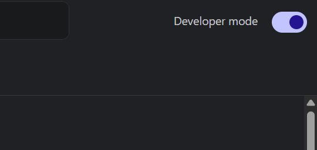
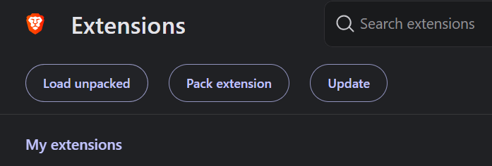
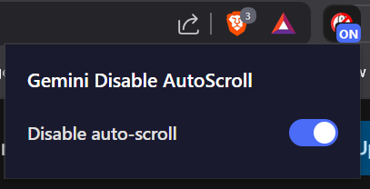
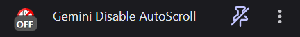
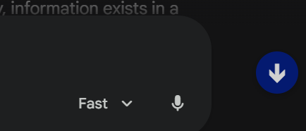

# Gemini Disable AutoScroll

### Just a simple extension for toggling auto-scroll for Gemini response generation.

## How to use it

1. Clone this repository

2. Go to the extensions page (`chrome://extensions/`, `brave://extensions/`, `edge://extensions/`, etc.)

3. Enable Developer mode in top right corner

4. Click on Load unpacked in top left corner

5. Select the folder where you cloned the repository

### Congrats! That's all.
### You can now go to Gemini and use it

## Overview 

### Popup interface

### Extension when disabled

### Scroll-to-bottom button

## Credits

### Icons
- [Scroll icon](https://www.flaticon.com/free-icon/mouse_15712478) created by [Indygo](https://www.flaticon.com/authors/indygo) - [Flaticon](https://www.flaticon.com)
- [Prohibition icon](https://www.flaticon.com/free-icon/prohibition_929457) created by [Freepik](https://www.flaticon.com/authors/freepik) - [Flaticon](https://www.flaticon.com)

### Tools
- [PineTools](https://pinetools.com/round-corners-image) - Used to round icon corners
